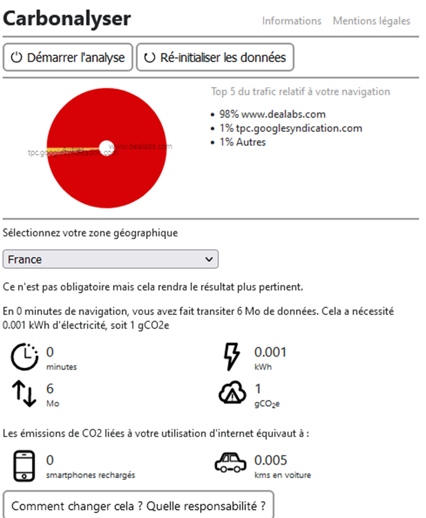
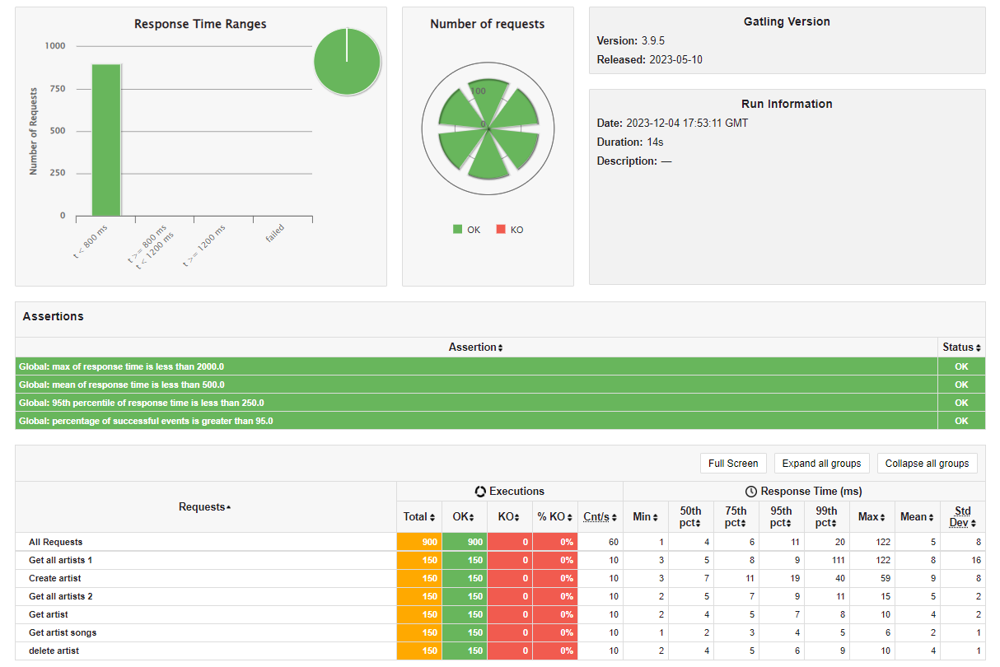

# Projet Reengineering

## Equipe
- AUZOU Geoffrey
- CARLIER Amandine
- DENORME William
- FREMEAUX Maxime
- MOREAU Bryan

## Projet refactorisation : Delivecrous (Node.js & MongoDB)

### Centralisation des codes de retour d'appel API

Nous avons décidé de placer les codes d'erreur de réponse dans un fichier, sous forme de constantes.
Cela permet d'uniformiser les codes au sein de l'application, d'éviter des erreurs, et en cas de modification d'un code, de ne pas avoir à le faire partout mais à un seul endroit.

### Middlewares

Nous avons consacré un temps conséquent sur la gestion d'erreur dans authentication.middleware.js. Cette discussion concernait le code contenu lors des levées d'exceptions. 
En fin de compte, il a été retenu que la série de conditions au sein de la méthode "catch" était la meilleure (car la seule) option.
En fait, l'utilsation d'un "switch case" n'était pas adaptée ici, car il fallait vérfier les types d'erreurs, ce qui n'est pas possible dans ce cas.

### Controllers

Nous avons évité d'utiliser des variables temporaires. Par exemple, nous retournons directement le résultat donné par les méthodes asynchrones faisant appel aux services. Nous avons aussi renommé certaines variables qui n'étaient pas assez explicites, en particulier pour un développeur junior.

### Simplification du code

Dans un premier temps, nous avons supprimé la déclaration inutile des variables, simplifiant ainsi le code source. Nous avons également extrait les messages d'erreurs, entre autres, dans des fichiers distincts pour faciliter la modification ultérieure des messages sans altérer le code principal et pour donner plus de contextualisation. Une simplification du code a été mise en oeuvre, en utilisant un package de type module, permettant l'adoption de la syntaxe ES6, renforçant ainsi la modernité du code. Aussi, les erreurs non détectées ont été corrigées pour éviter tout plantage potentiel de l'API lors de leur occurrence. Par ailleurs, nous avons ajouté la configuration du docker-compose pour que la base de données n'exige plus de mot de passe d'accès. De plus, les noms de variables ont été améliorés pour renforcer la clarté et conformité aux normes, ce qui favorise une meilleure compréhension pour les développeurs. Les fichiers inutiles contenant des constantes utilisées une seule fois ont été supprimés, épurant ainsi la structure du projet. Nous avons aussi standardisé la syntaxe des guillemets, en utilisant des guillemets simples, conforme à la convention JS recommandée. De la même manière, le camelCaseSyntax a été adoptée pour les fonctions et variables, tandis que SCREAMING_SNAKE_CASE a été utilisé pour les constantes, assurant une cohérence dans le style du code. Les égalités doubles ont été remplacées par des égalités triples pour une comparaison plus stricte. De surcroît, un nouveau type d'erreur personnalisé a été créé pour simplifier la gestion des erreurs et fournir des réponses plus détaillées. Par ailleurs, nous avons traduit les commentaires, la documentation et l'affichage en anglais pour homogénéiser la langue du code. L'authentification et la gestion des tokens ont été corrigées pour une meilleure sécurité. Enfin, la centralisation des fonctions a été effectuée pour rendre le code plus compréhensible, et les constantes ont été implantées directement dans le code lorsqu'elles n'étaient utilisées qu'une seule fois, optimisant ainsi la structure globale du projet.

### Axes d'amélioration

Nous aurions pu mettre en place des tests unitaires pour chaque route de cette API. Néanmoins, comme ils n'existaient pas auparavant et que des cas n'étaient pas traités, cela aurait pu faire un point sur ce qui existait et sur ce qui restait à traiter. De plus, cela aurait pu servir de support pour vérifier l'exhaustivité des cas à tester.
Nous aurions également pu mettre en place un système d'analyse static de code pour être sûrs que le code produit est conforme aux bonnes pratiques que nous nous sommes fixées sur le projet.

### Architecture Decision Record

Nous avions choisi de mettre en place un ADR afin de discuter de la gestion des conditions dans les cas d'erreurs. Cependant, après de multiples recherches, nous n'avons pas trouvé d'alternative.

Afin de garder une trace écrite de ce recherche, nous avons spécifié l'ADR suivant :

```
# Numéro
1

# Date
10/11/2023

# Auteur
Amandine

# Contexte
Nous avons eu un débat quant à la gestion d'erreurs dans authentication.`middleware.js`, en particulier dans les blocs de catch. 

# Options envisagées
Les différents choix portaient sur : 
- L'utilisation d'une série de conditions dans le bloc catch ;
- L'utilisation de if/else ou de ternaire ;
- L'utilisation d'un switch case.

# Décision
Nous choisissons de garder la série de conditions dans le cas où elles amènent au même code d'erreur, en effet nous en pouvons pas effectuer de série de catch en Node.js.

# Status
Terminé (cette solution a été mise en place autant que possible dans le projet).

# Conséquence
Nous décidons de mettre en place le document de décision pour uniformiser cette gestion d'erreur au sein du projet. 
```

## Projet éco-conception : echo (ReactJS & Java Springboot)

### Refactorisation du code côté API (car nouveau projet)

Dans le cadre de la refactorisation du code côté API, nous avons ajouté de la javadoc a été pour documenter les composants, favorisant ainsi une meilleure compréhension des fonctionnalités pour les développeurs. Des vérifications sur les objets ont été introduites, assurant leur non-nullité et renforçant le bon fonctionnement du projet. De plus, pour améliorer la lisibilité du code, les variables intermédiaires superflues ont été supprimées, et l'utilisation de lambda expressions a été privilégiée. La précision des exceptions a été aussi accentuée, facilitant le processus de débogage et de maintenance. Aussi, des validations ont été intégrées sur les paramètres des entités, par exemple avec l'annotation @NotNull, afin de renforcer la robustesse du code. L'utilisation de constantes a été mise en place pour rendre explicites les intentions du code, simplifiant ainsi la compréhension des développeurs. Enfin, dans une démarche de propreté du code, des packages, du code commenté et/ou inutile ont été supprimés, allégeant ainsi la base de code et facilitant sa gestion à long terme.

### Refactorisation du code côté APP (car nouveau projet)

#### Simplification du code

Pour cette simplification du code de la partie Front, nous avons entrepris plusieurs actions pour optimiser la structure du code et faciliter sa compréhension. Tout d'abord, les fichiers inutiles ont été éliminés, allégeant ainsi le projet. Les configurations de test ont été supprimées, étant donné l'absence de tests. Ensuite, une réorganisation des fichiers a été effectuée pour créer une architecture plus claire et plus intuitive, limitant ainsi la dette technique pour les nouvelles personnes qui arrivent sur le projet. Cela inclut l'ordonnancement des fonctions CSS afin de mieux comprendre l'impact de chaque fichier sur les composants respectifs. Les noms de classe CSS ont été renommés pour aligner leur syntaxe sur les directives recommandées, suivant ainsi les normes générales de dénomination en CSS. Les guillemets superflus ont été corrigés, tout comme les points-virgules manquants. De plus, l'URL de l'API de base a été modifiée en constante, facilitant ainsi les modifications ultérieures si nécessaire.

#### Axes d'amélioration

Nous aurions pu mettre en place des tests unitaires pour chaque composant de notre application web. En effet, bien que des tests unitaires sur des pages complètes ne soient pas utiles et seraient même détrimentaires aux améliorations futures du code, de par l'aspect rigide de ceux-ci, des tests par composant auraient pu être pertinent pour s'assurer de la conformité du visuel des parties atomiques de l'application. De plus, comme il, comme ils n'existaient pas auparavant, cela aurait pu faire un point sur ce qui existait et sur les objectifs à atteindre.
Nous aurions également pu mettre en place un système d'analyse static de code pour être sûrs que le code produit est conforme aux bonnes pratiques que nous nous sommes fixées sur le projet.

### Tests de différents plugins d'analyse

Afin de tester différents plugins d'analyse, nous avons choisi de s'appuyer sur le site : <a href="https://www.dealabs.com/">Dealabs</a>.

##### Lighthouse

Lighthouse est un outil d’audit automatisé initié par Google et accessible gratuitement pour tester les performances, l’accessibilité et le référencement d’un site web. Ainsi, nous pouvons aisément et rapidement tester nos sites internet. 

Cet outil nous permet de réaliser des audits et de mettre en lumière cinq informations essentielles d’un site :
- La performance : score permettant d’évaluer la performance d’un site web, il est estimé grâce à plusieurs métriques (pour assurer sa pertinence, l'équipe Lighthouse effectue régulièrement des recherches et recueille des commentaires pour comprendre ce qui a le plus grand impact sur les performances perçues par les utilisateurs) ;
- L’accessibilité : score indiquant le niveau d’accessibilité d’une application web, cela permet de savoir si elle est utilisable par les personnes handicapées ;
- Les bonnes pratiques : score reposant sur l’analyse des requêtes réalisées (http et https), la sécurisation des ressources exploitées et la vulnérabilité des bibliothèques utilisées ;
- Le SEO (ou optimisation pour les moteurs de recherche) : score se référant à l'ensemble des techniques qui visent à améliorer le positionnement d'une page, d'un site ou d'une application web dans la page de résultats d'un moteur de recherche ;
- Le PWA (progressive web app) : score provenant de l’analyse de la portabilité d’une interface web sur différents types d’écrans, cette mesure n’est pas toujours présente.

Tandis que l’EcoIndex est un service qui, à la suite de nombreuses contributions (le projet étant public), est devenu un outil collectif et ouvert à tous. Il permet de mesurer les émissions de gaz à effet de serre (aussi appelés GES) et la consommation en eau. Ainsi, la combinaison de ces deux outils nous permet d’auditer de façon plus précise nos diverses applications facilement.

##### Green IT Analysis (incluant l'éco-index)

C'est un outil intégré à la console du navigateur, qui permet très rapidement de générer un rapport. Nous retrouvons ensuite les détails de chaque page dans la partie "historique". 

Au long de cette phase d'analyse, nous allons utiliser l'EcoIndex. Nous pouvons retrouver des informations sur cet index sur le site suivant : <a href="https://www.ecoindex.fr/">https://www.ecoindex.fr/</a>.
Les principales métriques étudiées ici sont la consommation en eau, les émissions de GES et l'éco-index.

Il exporte les valeurs sous format d'un fichier CSV dont chaque colonne représente une métrique, interprétable par tout tableur.

##### Carbonalizer

Cette extension de navigateur permet de visualiser la consommation électrique et les émissions de gaz à effet de serre (GES) associées à une navigation internet.

Néanmoins, Carbonalyser n’est pas un outil d’évaluation ou d’audit. Il s’agit d’un support de sensibilisation individuelle, qui permet d’aider à visualiser un certain aspect de nos usages en ligne, au travers de comparaisons et d’indications sur la consommation électrique et émissions associées. Ces comparaisons se caractérisent par un nombre de recharges de téléphone qu'il aurait été possible de faire, ou encore le nombre de kilomètres qu'on aurait effectué en voiture pour la même quantité d'émission de CO2eq.

##### Comparaison de ces outils sur une page web

L’outil *LightHouse* est très orienté test technique, car il étudie les pages du site de façon isolée. Il propose des améliorations techniques (exemple : « Image elements do not have explicit width and height ») et une note par thème (performance, accessibilité, …).


*Carbonalyser*, quant à lui, est plus orienté test métier. En effet, il ne contient que des informations sur l’impact environnemental du site (ex : gCO2e). Il s’effectue sur un métier utilisateur, contrairement à *LightHouse* avec son fonctionnement « page par page ».



*GreenIT-Analysis*, lui, est plus ou moins la fusion de ces deux derniers outils. En effet, il fonctionne de manière « page par page » et affiche des conseils d’amélioration pour la page étudiée, comme le fait *LightHouse*  (GreenIt en propose moins). Cependant, il affiche aussi des informations sur l’impact environnemental comme le fait *Carbonalyser*.
 


Par rapport aux résultats de ces outils, nous pouvons constater qu’ils n’ont aucune valeur en commun. Par exemple, nous avons 2.88 gCO2e pour GreenIT alors que Carbonalyser donne 1 gCO2e, nous avons également 3800 DOM pour LightHouse contre 3076 DOM pour GreenIT.
De plus, il y a la présence de données non concrète dans ces outils. Par exemple, dans GreenIT, il y a l’attribut « EcoIndex » qui est ici à 6.02 ce qui correspond à une notation « G ». Cependant, nous ne savons pas concrètement ce que cela veut dire, ce qui peu amener à certaine confusion. Tout ce que nous savons, c’est que G est la plus basse note que l’outil puisse attribuer, ce qui laisse penser qu'il n’est pas du tout optimal d'un point de vue environnemental.
Ceci prouve donc que les résultats que nous obtenons dépendent grandement de l’outil utilisé et qu’il faut prendre en compte ces derniers avec précaution et contexte.

### Sélection des règles

#### Éliminer les fonctionnalités non essentielles

##### Lien vers la règle

<a href="https://github.com/cnumr/best-practices/blob/main/chapters/BP_001_fr.md">https://github.com/cnumr/best-practices/blob/main/chapters/BP_001_fr.md</a>

##### Description

Plusieurs études (Cast Software et Standish Group, notamment) démontrent que 70 % des fonctionnalités demandées par les utilisateurs ne sont pas essentielles et que 45 % ne sont jamais utilisées. En réduisant la couverture et la profondeur fonctionnelle de l’application, nous abaissons son coût de développement initial, sa dette technique et les impacts environnementaux associés.

On diminue ainsi mécaniquement l’infrastructure nécessaire à son exécution. Par ailleurs, à niveau ergonomique constant, plus l’application est pauvre fonctionnellement, plus elle sera simple à utiliser. Il faut donc réduire le plus possible la couverture fonctionnelle de l’application, en la centrant sur le besoin essentiel de l’utilisateur.

Détecter une fonctionnalité non essentielle est possible au moment de l'analyse de l'expression du besoin. La méthode MoSCoW, des ateliers, des wireframes (maquettes fonctionnelles) ou des prototypes avec tests utilisateurs permettent de vérifier l'utilité d’une fonctionnalité en amont de son développement.

##### Justification

Nous avons choisi cette règle car il nous semble important de prendre en compte l'impact environnemental et économique d'une application dès sa conception. En éliminant les fonctionnalités non essentielles, nous réduisons la complexité du code, limitons la dette technique, et minimisons les ressources nécessaires pour le développement et l'exécution de l'application. Cela contribue directement à une meilleure réduction des coûts de développement initial, ainsi que des impacts environnementaux et une diminution de la dette technique, tout en maintenant l'application centrée sur les besoins essentiels des utilisateurs.

#### Favoriser un design simple, épuré, adapté au web

##### Lien vers la règle

<a href="https://github.com/cnumr/best-practices/blob/main/chapters/BP_005_fr.md">https://github.com/cnumr/best-practices/blob/main/chapters/BP_005_fr.md</a>

##### Description

Tout design d'interface ou webdesign doit être réfléchi en amont, en prenant en compte :

- les besoins de l'utilisateur (voir la bonne pratique "Optimiser le parcours utilisateur")
- les heuristiques d'ergonomie (Bastien et Scapin, Nielsen, etc.)
- les contraintes techniques
- les bonnes pratiques d'écoconception et de préférence les bonnes pratiques d'accessibilité

Privilégiez un design simple et épuré réalisable uniquement en HTML et CSS.

##### Justification

La simplification et l'épuration des pages web sont des principes non négligeables pour garantir une meilleure expérience utilisateur. En adoptant un design simple, épuré, et adapté au web, nous améliorons la lisibilité, l'accessibilité, et réduisons la complexité du code. Cela permet non seulement d'optimiser les performances de l'application, mais aussi de limiter la consommation de ressources, favorisant ainsi une approche éco-conception tout en offrant une meilleure expérience aux utilisateurs. De plus, cela limite l'exécution du code aux éléments essentiels uniquement.

#### Proposer un traitement asynchrone lorsque c'est possible

##### Lien vers la règle

<a href="https://github.com/cnumr/best-practices/blob/main/chapters/BP_008_fr.md">https://github.com/cnumr/best-practices/blob/main/chapters/BP_008_fr.md</a>

##### Description

Lorsque l’interaction avec l’utilisateur induit un traitement lourd et long côté serveur, proposer un traitement asynchrone lorsque c’est possible. L’idée est d’encourager l’utilisateur à déclencher le traitement, puis à se reconnecter quand celui-ci est terminé sans attendre sur son terminal la fin de l'exécution ; par exemple, via la réception d’un e-mail contenant un lien. Cette approche permet de réaliser des traitements par lots (batchs), souvent plus efficients en ressources que des traitements synchrones à la volée. Nous libèrons ainsi les serveurs de présentation, qui peuvent prendre en charge d’autres internautes pendant que le traitement s’effectue en mode asynchrone côté serveur. Il est également plus aisé de lisser la charge du serveur responsable du traitement, ce qui permet une meilleure mutualisation de serveurs et par conséquent moins de serveurs.

##### Justification

La mise en place d'un traitement asynchrone présente de nombreux avantages en termes d'efficacité, de gestion des ressources, et d'expérience utilisateur. En effet, en permettant aux utilisateurs de déclencher des traitements lourds de manière asynchrone, nous réduisons les temps d'attente (en exploitant le multi-threading), optimisons l'utilisation des ressources serveur, et contribuons à une exécution plus efficiente des divers traitements. Cela se traduit par une meilleure réactivité de l'application tout en minimisant son impact environnemental. De plus, le chargement progressif des différents éléments d'une page nous permet d'afficher les données déjà disponible, sans avoir à recharger l'intégralité de la page, ce qui peut être très énergivore. 

#### Créer une architecture applicative modulaire

##### Lien vers la règle

<a href="https://github.com/cnumr/best-practices/blob/main/chapters/BP_014_fr.md">https://github.com/cnumr/best-practices/blob/main/chapters/BP_014_fr.md/</a>

##### Description

L’architecture modulaire popularisée par les logiciels open source apporte souvent une plus grande capacité à monter en charge, des coûts réduits de maintenance corrective et évolutive, ainsi qu’un code plus efficient. Si la couverture fonctionnelle du site web ou du service en ligne peut être amenée à évoluer, mieux vaut implémenter les fonctionnalités de base dans un noyau et les compléter au besoin par des modules. Ces modules peuvent rassembler des fonctions appartenant à un même domaine métier. Cela permet de les développer indépendamment des autres domaines métier ainsi que les partager à d'autres applications.

Cette approche est valable à tous les niveaux de granularité, pour un développement sur mesure comme pour le choix d’un serveur HTTP ou d’un CMS.

##### Justification

L'adoption d'une architecture applicative modulaire s'aligne avec les principes d'éco-conception en favorisant la réutilisation du code, la diminution des redondances, ainsi que la flexibilité du développement. En permettant le développement indépendant de modules, cette approche réduit la complexité du code, facilite la maintenance, et offre une plus grande adaptabilité aux évolutions fonctionnelles. Elle contribue ainsi à la réduction de la dette technique et à une utilisation plus efficace des ressources. De surcroît, cela permet de rendre possible l'interconnexion entre composants de différentes technologies, de façon à optimiser les ressources existantes, ainsi qu'à pouvoir interchanger les diverses couches, sans devoir refactoriser l'intégralité d'un projet.

#### Découper les CSS

##### Lien vers la règle

<a href="https://github.com/cnumr/best-practices/blob/main/chapters/BP_021_fr.md">https://github.com/cnumr/best-practices/blob/main/chapters/BP_021_fr.md</a>

##### Description

Employer un ensemble de CSS plutôt qu’une seule, et appeler uniquement les CSS utiles en fonction du contexte. Cette méthode permet de limiter le poids de la page lors du premier téléchargement, donc d’économiser de la bande passante et de réduire la charge CPU.

##### Justification

La découpe des fichiers CSS en plusieurs fichiers favorise la modularité et la légèreté des pages web. En adoptant cette pratique, nous limitons le poids des fichiers CSS téléchargés initialement, réduisant ainsi la consommation de bande passante et la charge CPU, puisque ces derniers ne sont sollicités que sur les composants des pages en question. Cette approche contribue à une meilleure performance du site, tout en minimisant son impact environnemental, en optimisant l'utilisation des ressources et en factorisant les différents styles d'un projet.

#### N'utilisez que les portions indispensables des bibliothèques JavaScript et frameworks CSS

##### Lien vers la règle

<a href="https://github.com/cnumr/best-practices/blob/main/chapters/BP_040_fr.md">https://github.com/cnumr/best-practices/blob/main/chapters/BP_040_fr.md</a>

##### Description

Les bibliothèques JavaScript telles que jQuery et les frameworks CSS prêts à l’emploi (Bootstrap, skeleton, gumby, foundation…) sont d’excellents outils pour réaliser rapidement des sites, car ils répondent à presque tous les besoins les plus courants. Revers de la médaille, nous n’en utilisons généralement qu’une petite portion ; or ces frameworks et bibliothèques ne s’appuient pas tous sur une architecture modulaire, ce qui contraint l’internaute à télécharger toute la librairie pour n’utiliser qu’un faible pourcentage de ses fonctionnalités.

Dans la mesure du possible, il est préférable de se passer de ces bibliothèques (voir <a href="https://youmightnotneedjquery.com">https://youmightnotneedjquery.com</a>) ou de n’en conserver que les portions réellement utilisées (voir <a href="https://getbootstrap.com/customize">https://getbootstrap.com/customize</a>).

Utiliser un bundler (ex: Webpack) permet de faire facilement du tree shaking, soit d'éliminer du code "mort" donc non utilisé.

##### Justification

L'utilisation sélective des bibliothèques JavaScript et frameworks CSS répond à une logique d'optimisation des performances et de réduction de la consommation de ressources. En effet, en n'utilisant que les portions nécessaires de ces bibliothèques, nous évitons le surchargement inutile de code, améliorons la lisibilité, et limitons les effets de bord indésirables. Cette pratique favorise une approche plus économe en ressources, alignée avec les principes d'éco-conception. Aussi, cela peut aussi éviter de générer des comportements qui ne sont pas forcément souhaités, ce qui limite encore une fois les effets de bord.

#### Modifier plusieurs propriétés CSS en 1 seule fois

##### Lien vers la règle

<a href="https://github.com/cnumr/best-practices/blob/main/chapters/BP_045_fr.md">https://github.com/cnumr/best-practices/blob/main/chapters/BP_045_fr.md</a>

##### Description

Pour limiter le nombre de repaint/reflow, il est conseillé de ne pas modifier des propriétés une à une. Préférer l’ajout/la suppression de classes CSS, ce qui permet de modifier en une seule fois plusieurs propriétés, tout en ne générant qu’un repaint/reflow (voir <a href="https://github.com/cnumr/best-practices/blob/main/chapters/BP_045_fr.md">la bonne pratique n° 45</a>).

##### Justification

L'approche évoquée ici, qui consiste à regrouper des propriétés CSS, offre des avantages en termes d'efficacité et de réduction des opérations. En effet, en regroupant les modifications dans des classes CSS, nous limitons les changements, réduisant ainsi la complexité du code et évitant les répétitions inutiles. Cela contribue à une optimisation des performances et à une diminution de la dette technique, ainsi que du code mort.

#### Mettre en cache les objets souvent accédés en JavaScript

##### Lien vers la règle

<a href="https://github.com/cnumr/best-practices/blob/main/chapters/BP_049_fr.md">https://github.com/cnumr/best-practices/blob/main/chapters/BP_049_fr.md</a>

##### Description

L’accès au DOM (Document Object Model) est coûteux en termes de ressources processeur (cycles CPU). Aussi, lorsque vous utilisez plusieurs fois le même élément du DOM depuis JavaScript, stockez sa référence dans une variable afin de ne pas parcourir à nouveau le DOM pour ce même élément.

##### Justification

La mise en cache des objets en JavaScript représente une pratique efficiente pour minimiser les accès coûteux et le nombre de requêtes HTTP(S) ou à la base de données, réduisant ainsi la consommation de ressources CPU. De plus, cette approche contribue à une exécution plus fluide des opérations JS, limitant l'impact environnemental associé.

#### Réduire le volume de données stockées au strict nécessaire

##### Lien vers la règle

<a href="https://github.com/cnumr/best-practices/blob/main/chapters/BP_4011_fr.md">https://github.com/cnumr/best-practices/blob/main/chapters/BP_4011_fr.md</a>

##### Description

Réduire le volume de données stockées au nécessaire consiste à :

- Optimiser la gestion des gros volumes de données ;
- Nettoyer les anciennes données, soit en les archivant hors ligne, soit en les supprimant ;
- Vérifier que les sauvegardes peuvent être restaurées ;
- Superviser la taille des espaces de stockage.

Suivant le type de données et leurs propriétaires, des contraintes légales peuvent amener à stocker dans le temps des données jamais utilisées.

L’utilisation des données et leur degré d’importance impactent aussi la manière de les stocker.

Cette bonne pratique s'inscrit dans le cadre de la gestion du cycle de vie de l'information.

##### Justification

Réduire le volume de données stockées au strict nécessaire s'inscrit dans une approche de gestion responsable des ressources. En optimisant la gestion des données, en nettoyant les anciennes données et en supervisant les espaces de stockage, nous limitons la surcharge inutile des infrastructures et contribuons à une utilisation plus efficiente des ressources. Cela favorise la durabilité environnementale, la réduction des coûts liés au stockage des données, ainsi que la dette technique.

#### S'assurer que les parcours utilisateurs permettent de réaliser leur action prévue

##### Lien vers la règle

<a href="https://github.com/cnumr/best-practices/blob/main/chapters/BP_4014_fr.md">https://github.com/cnumr/best-practices/blob/main/chapters/BP_4014_fr.md</a>

##### Description

Des services web permettent de réaliser sans se déplacer des démarches administratives, des ouvertures de contrats, des déclarations de sinistres etc... Beaucoup de ces procédures peuvent être complexes à réaliser ou ne pas prendre en compte des cas particuliers. Pour valider la connexion à un service bancaire en ligne par exemple, l'installation d'une application mobile et donc un smartphone peuvent être exigés. Certains utilisateurs peuvent donc se retrouver bloqués dans l'utilisation du service. La mise en place d'une alternative plus "low tech" (appel téléphonique, SMS, point d'accueil physique) peut pallier à cette situation.

##### Justification

S'assurer que les parcours utilisateurs permettent de réaliser leur action prévue, autrement dit concevoir un système interactif bien pensé, garantit une utilisation efficace des services web tout en limitant les besoins en ressources, puisque nous réduisons le nombre de requêtes nécessaires. Aussi, en simplifiant les démarches et en offrant des alternatives "low tech" lorsque nécessaire, nous réduisons le nombre d'interactions complexes, diminuant ainsi la charge tant du côté utilisateur que du côté serveur. Cette approche contribue à une meileure expérience utilisateur, tout en minimisant l'empreinte environnementale.

### Utilisation des outils de monitoring des performances et d'évaluation de charge

#### Perf et Flamegraph

##### Définition

Tout d'abord, perf est un outil de ligne de commande pour la collecte de données de performances sous Linux. Il fait partie du paquetage "perf-tools" et est souvent utilisé pour profiler le comportement d'un programme, en mesurant diverses métriques telles que le temps d'exécution, les appels système, les interruptions, etc. Cet outil peut également générer des rapports détaillés pour aider les développeurs à identifier les goulots d'étranglement et à optimiser les performances de leurs applications.

Puis, flamegraph permet lui de réaliser une représentation graphique interactive qui affiche les données de profilage. Le flamegraph affiche une hiérarchie des fonctions appelées dans une application, avec la largeur des barres indiquant la quantité de temps ou de ressources consommée. Les barres sont disposées de manière à représenter la pile d'appels, facilitant ainsi l'identification des parties du code qui méritent une attention particulière en termes d'optimisation. Par conséquent, l'utilisation de cet outil peut grandement simplifier le processus d'analyse des performances, en permettant aux développeurs de visualiser rapidement les zones critiques du code et de prendre des décisions informées sur les améliorations à apporter.

Ainsi, ces deux outils sont souvent utilisés de pair pour analyser, puis visualiser facilement les performances et les parties du code qui consomment le plus de ressources.

##### Résultats

Voici les résultats obtenus avec ces deux outils :

- Premièrement avec l'exécution d'une seule requête :


- Deuxièmement avec l'exécution de mille requêtes :


#### Gatling

##### Définition

Tout d'abord, Gatling est un outil open-source de test de performance, utilisé pour simuler des charges de travail virtuelles sur des applications web afin de mesurer leur performance. Il utilise le langage de script Scala pour définir des scénarios de test (nous pouvons également utiliser le Java et le Rust) et propose à la fois une interface utilisateur graphique (Gatling FrontLine) et une interface en ligne de commande. Néanmoins, Gatling seul ne nous aide pas dans le contexte de l'éco-conception. C'est pourquoi, à ces fins, nous devons le coupler à l'outil Top, utilisable en ligne de commande.

##### Résultats

Suite à l'exploitation de l'outil Gatling, nous avons identifié plusieurs problèmes. Lors de l'exécution de requêtes GET, en l'absence de données dans la base de données, le contrôleur Spring renvoie un code d'erreur (par exemple, `getAllArtist` renvoie une erreur 404). Cette pratique n'étant pas recommandée, il est nécessaire d'ajuster ce comportement.

En ce qui concerne Top, nous avons observé un potentiel problème de performance. La consommation du CPU oscille en moyenne autour de 40%, avec des pics atteignant jusqu'à 373%. Il est donc impératif d'analyser et de résoudre ce problème.\




Nous pouvons maintenant constater ci-dessous que toutes les requêtes ont obtenues un résultat "ok". Cela fait suite aux modifications effectuées sur le code, notamment au niveau des contrôleurs, en ne renvoyant plus une erreur 404 lorsque aucune donnée n'a été trouvé dans la BDD.

Ceci est dû au fait que suite au changement, nous envoyons une liste vide au lieu d'une erreur (aucun changement n'a dû être effectué du coté front).


De plus, Top nous a permis de constater que le pique d'utilisation de notre application est descendu d'environ 20% (de 93.5% à 72%) avec une utilisation moyenne inchangée.


## Projet de Dockerisation et de déploiement : echo

### Définition

La conteneurisation Docker offre de nombreux avantages pour le déploiement d’applications. Tout d’abord, elle permet une portabilité accrue. Les conteneurs Docker encapsulent tout ce dont une application a besoin pour fonctionner, y compris le système d’exploitation, les dépendances et les bibliothèques. Cela signifie que vous pouvez exécuter votre application sur n’importe quelle machine qui a Docker installé, sans vous soucier des problèmes de compatibilité. Deuxièmement, Docker offre une isolation entre les conteneurs, ce qui signifie que chaque application s’exécute dans son propre environnement sécurisé et ne peut pas interférer avec les autres. Enfin, Docker permet une mise à l’échelle facile.

### Conteneurisation

Pour initier la phase de construction et d’exécution de l’ensemble des conteneurs Docker nécessaires au projet `echo`, exécuter la commande suivante à la racine du projet. 

```bash
docker compose --profile all up -d
```

Cette commande garantit que toutes les dépendances sont correctement gérées et que l’environnement est configuré pour le bon fonctionnement du projet.

Après avoir effectué les opérations de construction et d’exécution des conteneurs Docker, vous pouvez observer l’état de ces conteneurs via l’interface de “Docker Desktop”. Vous devriez voir un affichage similaire à celui ci-dessous, qui liste tous les conteneurs Docker associés à notre projet.

À noter que pour la conteneurisation de ce projet, nous avons instancié plusieurs dockerfiles : 
- un pour le front de notre aplication (notre `app`) ;
- un pour le back de notre application (notre `api`) ;
- un pour la base de données de notre application (`hsqldb`).

Ensuite, nous avons réalisé le `docker-compose` qui permet d'orchestrer l'ensemble des dockerfiles préalablement écrit.


```
# Numéro
2

# Date
18/12/2023

# Auteur
Amandine

# Contexte
Nous avons eu un échangé autour de la présence de la commande `mvn spring-boot:run` au sein du docker-compose. En effet, cette dernière n'est pas optimisée, car elle implique la recompilation du code à chaque fois, et cela peut être causer des erreurs par la suite

# Options envisagées
Les différents choix portaient sur : 
- Garder la ligne de commande ;
- La remplacer par un .jar du projet.

# Décision
Nous choisissons de générer les .jar et de les lancer, sans utiliser la commande maven.

# Status
Terminé (cette solution a été mise en place autant que possible dans le projet).

# Conséquence
Cet ADR nous permet d'unifier et de clarifier le lancement des applications au sein des docker-compose et nous permet d'éviter les erreurs non souhaitées. 
```

### Orchestration via Kubernetes

Pour commencer, il a été nécessaire d'installer Rancher Desktop au préalable. Pour plus de précision, Rancher est une plateforme open-source simplifiant la gestion de clusters Kubernetes. Il offre une interface conviviale pour le déploiement, la configuration et la supervision des applications conteneurisées, facilitant ainsi l'administration de Kubernetes.

Dans un premier temps, nous nous sommes concentré sur la partie front de notre projet `echo`. De cette façon, voici les commandes qui ont été utilisées pour mettre en place notre orchestrateur : 

```
rancher-desktop // permet de lancer l'API Rancher
docker-compose --profile all build // génère un conteneur localement
docker tag echo-app rancher/echo-app // renomme le conteneur
kubectl run echoapp --image=echo-app --image-pull-policy=Never // exécute l'image sous Kubernetes
kubectl get pods echoapp // vérifie l'état du pod (devrait être running)
kubectl port-forward pods/echoapp 8080:80

kubectl create deployment echoapp --image=echo-app
// changement du fichier de config (ajout de imagePullPolicy: Never dans specs/containers du fichier manifest.yaml)
```

Une fois toutes ces lignes de commandes réalisée, nous avons pu récupérer le `manifest-app.yaml` généré et le modifier afin de ne garder que les éléments nécessaires. Nous l'avons ensuite déplacé dans le répertoire `kubernetes` de notre projet `reengineering`.

L'idée maintenant est de créer deux autres `manifest.yaml`, afin d'en obtenir au final trois différent, de pouvoir segmenter notre application en diverses briques et d'être cohérent avec nos dockerfiles :
- un pour le front de notre aplication (notre `app`) ;
- un pour le back de notre application (notre `api`) ;
- un pour la base de données de notre application (`hsqldb`).

Un défi important que nous avons rencontré lors de la configuration de notre application orchestrée par Kubernetes était la gestion de la connexion à la base de données, particulièrement en ce qui concerne l'alignement avec le III. Config des 12 factors, où la configuration doit être distincte du code. Initialement, la configuration de la base de données résidait dans le backend, ce qui entraînait un désaccord avec les principes des 12 factors.

Pour résoudre ce problème, nous avons choisi de surmonter cette configuration en utilisant des variables d'environnement. Nous avons ajusté le `manifest-api.yaml` de notre API `api` en utilisant des entrées "env" pour établir le lien avec la base de données. Cette approche nous a permis de séparer la configuration du code, suivant ainsi les meilleures pratiques des 12 factors.

Cependant, cette modification a également nécessité une adaptation dans le `manifest-db.yaml` de la base de données `hsqldb`. Pour que les autres pods puissent accéder à la base de données, nous avons introduit un service Kubernetes. Ce service identifie les pods utilisés et met à leur disposition les informations nécessaires pour établir la connexion avec la base de données. Cette stratégie nous a permis de maintenir une architecture cohérente tout en résolvant efficacement les problèmes liés à la gestion de la configuration de la base de données dans un environnement Kubernetes orchestré par Rancher.
